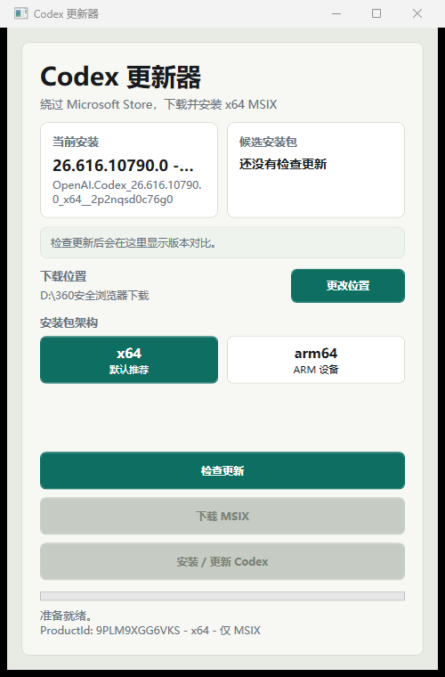
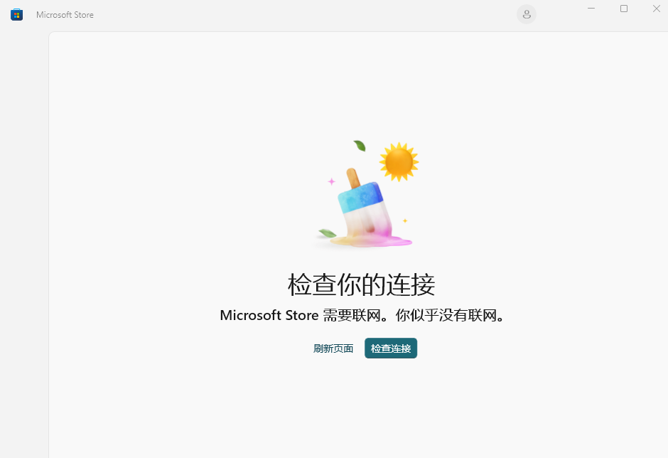
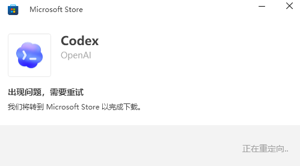

# codex下载安装器 / Codex Installer

一个用于 Windows 的 Codex 桌面版下载安装器。当 Microsoft Store 打不开、无法联网、一直跳转失败，或者无法从商店正常下载 Codex 时，可以用它自动获取 Microsoft Store 的 MSIX 安装包并本地安装。

Codex Installer is a Windows helper for installing or updating the OpenAI Codex desktop app when Microsoft Store cannot download it normally.



## 解决的问题 / Problem

在部分 Windows 环境下，Microsoft Store 会出现无法连接、无法跳转或无法完成 Codex 下载的问题：





本工具的目标是绕过 Microsoft Store 客户端界面，直接下载并安装 Codex 的 `.msix` 包。

This tool bypasses the Microsoft Store app UI and installs the Codex `.msix` package directly.

## 原理 / How It Works

1. Codex 在 Microsoft Store 中的 ProductId 是 `9PLM9XGG6VKS`。
2. 工具内置 WebView2 浏览器，在需要时打开 `store.rg-adguard.net`。
3. 工具自动填写 ProductId，生成 Microsoft Store 包下载链接。
4. 根据你选择的架构筛选安装包：
   - 默认 `x64`
   - 可选 `arm64`
   - 自动忽略 `.BlockMap`
5. 下载 `OpenAI.Codex_..._x64...msix` 或 `OpenAI.Codex_..._arm64...msix`。
6. 安装前校验包名、架构、扩展名和文件大小。
7. 使用管理员权限执行：

```powershell
Add-AppxPackage -Path "下载到的 MSIX 文件路径"
```

如果 Codex 正在运行，工具会提示你确认关闭后再安装，避免 `0x80073D02` 这类“资源正在使用”的错误。

## 使用说明 / Usage

1. 下载 Release 里的 `CodexInstaller-win-x64.zip`。
2. 解压后运行 `CodexUpdater.App.exe`。
3. 选择下载位置。
4. 保持默认 `x64`，除非你的电脑是 ARM64。
5. 点击 `检查更新`。
6. 如果弹出 `rg-adguard 链接浏览器` 并出现验证，请在弹窗内完成验证。
7. 点击 `下载 MSIX`。
8. 点击 `安装 / 更新 Codex`。
9. 按提示同意 UAC 管理员权限。

## Version Comparison

检查更新后，工具会显示本地版本和远程版本的对比：

- 本机未安装 Codex：提示可执行全新安装。
- 远程版本高于本地版本：提示可以更新。
- 远程版本等于本地版本：提示可按需重新安装。
- 远程版本低于本地版本：提示不建议安装。

## Build

Requirements:

- Windows
- .NET SDK 10
- Microsoft Edge WebView2 Runtime

Build and publish:

```powershell
.\build.ps1
```

The framework-dependent output is written to `publish\`.

For a release package:

```powershell
dotnet publish .\src\CodexUpdater.App\CodexUpdater.App.csproj -c Release -r win-x64 --self-contained true -o .\dist\CodexInstaller-win-x64
Compress-Archive -Path .\dist\CodexInstaller-win-x64\* -DestinationPath .\dist\CodexInstaller-win-x64.zip -Force
```

## Notes

- This project does not modify Microsoft Store itself.
- The generated package links come from Microsoft Store delivery links exposed through `store.rg-adguard.net`.
- Only packages matching `OpenAI.Codex` and the selected architecture are accepted.
- The download folder setting is stored in `%LOCALAPPDATA%\CodexUpdater\settings.json`.
