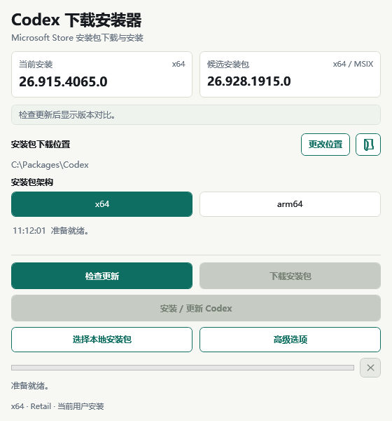
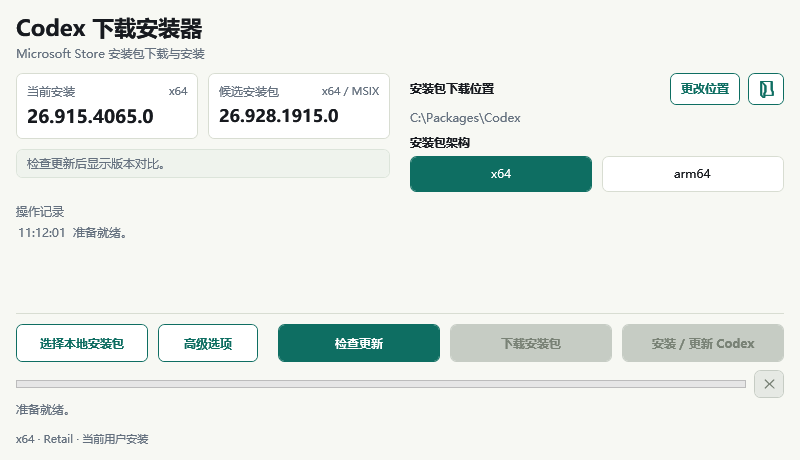
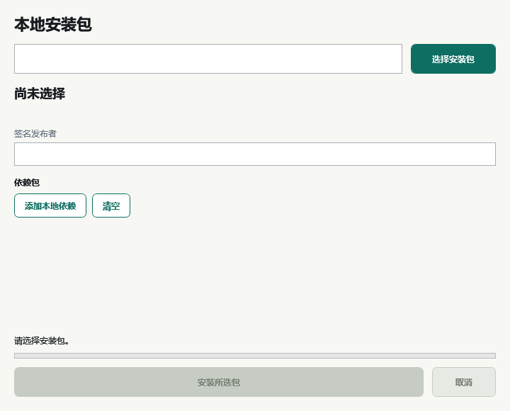
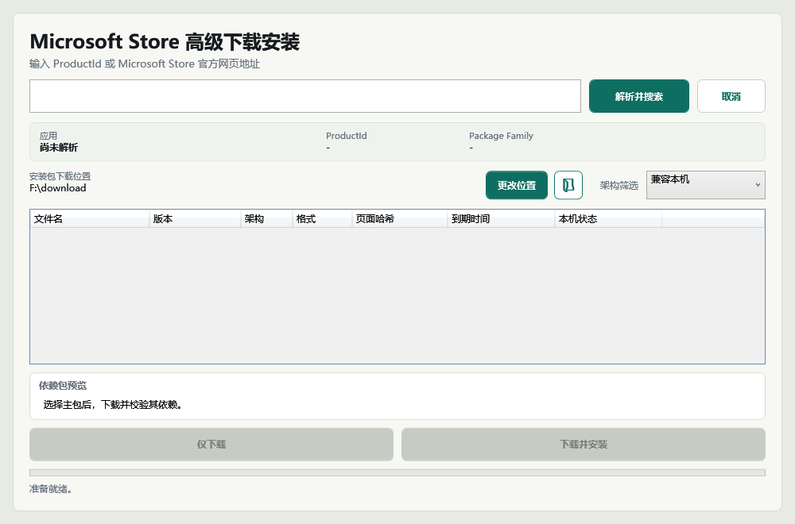

# codex下载安装器 / Codex Installer

一个用于 Windows 的 Codex 桌面版下载安装器。当 Microsoft Store 无法打开、跳转失败或不能正常下载 Codex 时，可以用它获取 MSIX 安装包并在本地安装。也支持其他 Store 应用，以及手动选择本地安装包。

Codex Installer is a Windows helper for downloading, installing, and updating the OpenAI Codex desktop app when Microsoft Store cannot download it normally. It also supports verified local packages and an advanced Microsoft Store mode.

> 本项目是第三方社区工具，不是 OpenAI 或 Microsoft 官方安装器。
> This is an independent community tool, not an official OpenAI or Microsoft installer.

## 直接下载 / Download

**[直接下载已发布稳定版 EXE](https://github.com/puppnn/codex-installer/releases/latest/download/CodexInstaller-win-x64.exe)**

| 版本 | 获取方式 | 功能范围 |
| --- | --- | --- |
| 已发布稳定版 v1.1.0 | 上方 EXE 直链或 [Releases](https://github.com/puppnn/codex-installer/releases/latest) | Codex 下载更新、Microsoft Store 高级模式 |
| 当前源码 v1.2.0 | [下载 main 源码](https://github.com/puppnn/codex-installer/archive/refs/heads/main.zip) 或 [GitHub Actions 构建产物](https://github.com/puppnn/codex-installer/actions/workflows/ci.yml) | 新增本地安装、打开下载目录、自适应布局和错误诊断 |

v1.2.0 尚未创建正式 Release。要直接体验本次更新，可在 Actions 中选择 **main 分支最新成功构建**，下载 Artifacts 中的 `CodexInstaller-win-x64`，解压后运行 EXE；下载 Actions 产物需要登录 GitHub。源码 ZIP 不包含编译好的 EXE，可按下方构建说明编译。

发布和 CI 生成的自包含 EXE 面向 Windows x64，无需预装 .NET。安装器中的 `arm64` 选项选择的是目标应用包架构；安装器本身仍是 x64 程序。

以下使用说明和截图对应当前源码/CI 版。截图中的版本号和路径仅作演示。



## 解决的问题 / Problem

在部分 Windows 环境中，Microsoft Store 会无法连接、无法跳转或无法完成 Codex 下载：


本工具绕过的是 Microsoft Store 客户端界面，不会修改 Microsoft Store，也不会绕过应用许可或 DRM。

## Codex 使用说明 / Codex Usage

1. 下载 EXE 并运行。
2. 若电脑缺少 WebView2，程序会在你确认后，通过内置的微软引导程序联网安装 Runtime。
3. 选择安装包下载位置，按设备选择 `x64` 或 `arm64`；默认是 `x64`。
4. 点击 `检查更新`。每次查询都会重新加载页面，并与本机版本比较。
5. 若弹出内置浏览器，请手动完成页面验证；获取结果后浏览器会自动隐藏。
6. 点击 `下载安装包`。已有文件通过页面哈希、签名和包身份复验后，会直接复用；必需依赖也会进行检查。
7. 点击 `安装 / 更新 Codex`，核对确认框。若 Codex 正在运行，请先保存工作；确认后程序会尝试关闭对应应用进程并安装。

点击下载位置右侧的**文件夹按钮**即可打开下载目录。查询和下载可以取消；Windows 开始安装后会等待安装结果。

主界面会随窗口尺寸调整：窄窗口纵向排列，宽窗口将版本信息和下载设置分成双栏，并重排操作按钮。拉高窗口可以查看更多操作记录；窗口过矮时信息区可滚动，底部操作按钮保持可见。操作记录仅保存在当前会话内。



## 本地安装 / Local Packages

已经下载好安装包时，无需重新查询 Store：

1. 点击主界面的 `选择本地安装包`。
2. 选择 `.msix`、`.appx`、`.msixbundle` 或 `.appxbundle`。
3. 等待验证数字签名，并查看应用版本、架构、发布者和包族。
4. 若提示缺少依赖，点击 `添加本地依赖`，选择对应的已下载框架包。
5. 点击 `安装所选包`，核对信息并确认。

程序会检查本机版本、架构、Windows 最低版本和必需依赖，并在安装前重新校验文件。较旧版本、不兼容的架构和未通过签名验证的包会被阻止安装。

本地模式直接处理你选择的文件，不依赖 rg-adguard 或 Store 页面，也不需要打开 WebView2。它不会将本地文件标记为经过 Store 元数据验证的下载，也不会自动关闭其他应用。



## 高级模式 / Advanced Usage

1. 点击 `高级选项`。
2. 输入 Microsoft Store ProductId，或粘贴微软官方 Store 网页地址。
3. 点击 `解析并搜索`，查看经过验证的应用名称、包族和主包列表。
4. 选择版本和架构，再选择 `仅下载` 或 `下载并安装`。
5. 下载主包后，程序会解析实际应用版本和依赖；安装前还会再次进行兼容性检查。

文件保存到 `<自定义下载目录>\<ProductId>\<版本>\<架构>`。 `仅下载` 会尝试一并下载必需依赖，即使本机已经安装这些依赖。第三方应用仍可能需要有效的 Store 许可。

对于 Bundle，列表中的包版本与内部实际应用版本可能不同。程序使用实际应用版本判断降级，安装时按照本机架构选择内部应用包。

若应用显示使用 `WPM` 安装器，说明它实际分发的是 EXE/MSI 等 Win32 安装器，不能使用 `Add-AppxPackage`，本工具会停止该流程。



## 支持范围 / Scope

支持：

- Codex 的 x64、arm64 MSIX 下载、安装和版本比较。
- 使用 `WindowsUpdate` 分发的未加密 APPX/MSIX 应用及 Bundle。
- 手动选择经过 Windows 签名验证的本地包和框架依赖。
- 检查本机架构、Windows 最低版本、已安装版本和必需依赖。
- 全新安装、更新、相同版本重新安装；旧版本可下载，但禁止自动降级。

不支持：

- WPM、传统 Win32 EXE/MSI 安装器、加密包和大型游戏安装器。
- 将资源包或框架包单独作为主应用安装。
- 绕过购买、账号许可、区域限制或 DRM。下载成功不代表未拥有许可的应用可以注册。

## 原理 / How It Works

1. Codex 的 Store ProductId 是 `9PLM9XGG6VKS`。高级模式会先从微软官方页面核对 ProductId、安装器类型、平台和包族。
2. 程序通过 WebView2 访问 `store.rg-adguard.net`，使用 `Retail` 渠道生成临时链接。页面需要验证时，由用户手动完成。
3. 安装包下载只接受 `delivery.mp.microsoft.com` 及其子域名，并在连接前检查每次重定向。
4. 下载优先使用 HTTPS；仅在原始链接本来就是微软 CDN HTTP 地址且 HTTPS 失败时进行受限回退，不关闭证书验证。
5. 安装包经过 Windows 签名验证，再检查 Manifest、发布者、PFN、版本、架构和依赖。
6. 安装前重新校验文件，并以当前 Windows 用户通过系统 PowerShell 执行：

```powershell
Add-AppxPackage -Path "主安装包路径" -DependencyPath @("依赖包路径")
```

程序使用系统 PowerShell 的绝对路径和编码命令，不整体请求管理员权限。下载有单文件大小限制、总量限制、读取超时和取消清理；临时链接失效时会重新查询一次。

## 常见问题 / Troubleshooting

| 提示 | 含义与处理 |
| --- | --- |
| `0x80073D02` | 应用仍在运行或文件被占用。保存工作并退出相关应用后重试。 |
| `0x80070490` | Windows 包存储库注册时找不到元素。先重启后重试；若持续失败，根据错误详情排查系统状态。程序不会自动重置注册信息。 |
| `0x80073CF3` | 依赖或兼容性检查失败。核对错误详情中的依赖、架构及系统要求。 |
| `0x80073D06` | 本机已有更高版本。选择相同或更新的安装包。 |
| `0x80070005` | 访问被拒绝。检查目录权限和系统安装策略。 |
| 签名或身份校验失败 | 停止安装，重新获取可信来源的包；不要跳过校验。 |

错误窗口提供中文摘要、可滚动详情和 `复制错误详情`。PowerShell 的 CLIXML 进度数据会被过滤，不再铺满整个弹窗。

## v1.2.0 更新 / What's New

当前 `main` 已包含：

- 打开下载目录、本地安装包预览与安装、本地依赖选择。
- 自适应主界面、始终可见的操作区、当前会话操作记录。
- 中文 PowerShell 输出、CLIXML 清理和分类错误提示。
- 查询刷新、验证码完成状态判断、取消、超时、重试及逐次重定向校验。
- Codex 和高级模式共用安装前检查，使用 Bundle 实际应用版本判断降级。
- 后台校验大文件，检查剩余下载预算，跳过可选依赖。
- 固定 WebView2 引导程序文件 URL；构建与运行时共享哈希清单。
- CI 分离编译、测试与发布步骤，原生命令失败立即停止。

Version 1.2 source adds responsive layouts, folder shortcuts, verified local-package installation, readable deployment errors, and shared installation checks. The existing v1.1.0 release remains available while v1.2 builds are provided through GitHub Actions.

详细变更见 [v1.2.0 说明](docs/releases/v1.2.0.md)。上一版本的高级 Store 功能及安全改动见 [v1.1.0 说明](docs/releases/v1.1.0.md)。

## 从源码构建 / Build

需要 Windows、.NET SDK 10 和网络连接。在包含 `CodexUpdater.sln` 的源码目录打开 PowerShell：

生成独立运行的单文件 EXE：

```powershell
.\build-full.ps1
```

输出：`dist\CodexInstaller-win-x64.exe`。脚本会恢复依赖、检查格式、编译、运行 xUnit 测试并打包。

生成依赖本机 .NET 10 Desktop Runtime 的目录版：

```powershell
.\build.ps1
```

输出：`publish\CodexUpdater.App.exe`。运行时需要保留整个 `publish` 目录，不能只复制其中的 EXE。

构建使用 `src/CodexUpdater.App/Vendor/WebView2Bootstrapper.json` 中固定的微软文件地址和 SHA-256，并验证微软数字签名。运行时复用同一份嵌入清单。更新引导程序时应先验证来源与签名，不要跳过校验。

GitHub Actions 在通过编译和测试后生成 EXE，并创建 GitHub artifact provenance attestation。构建证明与 Authenticode 代码签名是不同机制。

## 注意事项 / Notes

- 下载位置保存在 `%LOCALAPPDATA%\CodexUpdater\settings.json`。
- WebView2 用户数据保存在 `%LOCALAPPDATA%\CodexUpdater\WebView2`。
- 单文件上限为 2 GB，主包与依赖合计上限为 4 GB。
- 当前 EXE 没有商业 Authenticode 代码签名证书，Windows SmartScreen 可能显示未知发布者。
- 详细安全边界见 [SECURITY.md](SECURITY.md)。
