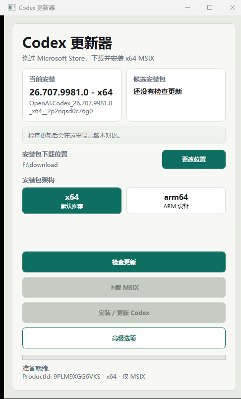
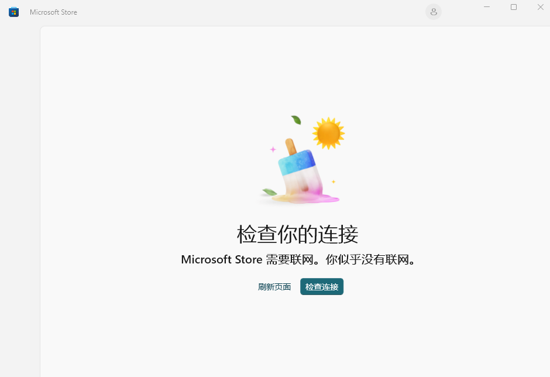
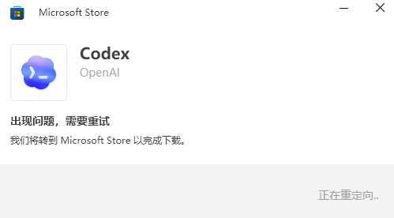
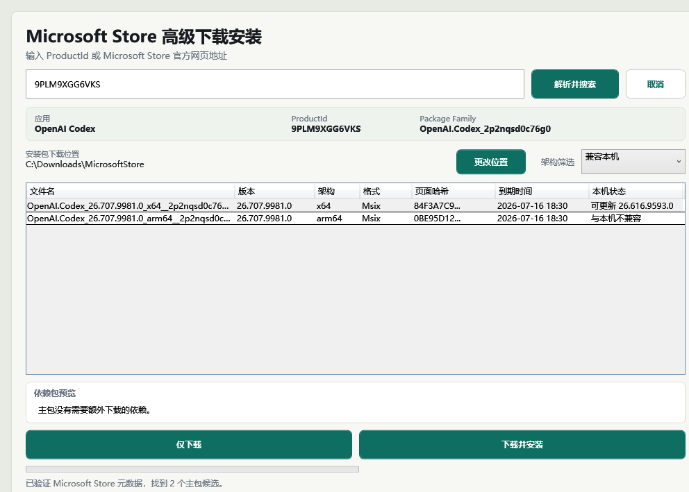

# codex下载安装器 / Codex Installer

一个用于 Windows 的 Codex 桌面版下载安装器。当 Microsoft Store 无法打开、跳转失败或不能正常下载 Codex 时，可以用它获取 Microsoft Store 的 MSIX 安装包并在本地安装。

Codex Installer is a Windows helper for installing or updating the OpenAI Codex desktop app when Microsoft Store cannot download it normally.

> 本项目是第三方社区工具，不是 OpenAI 或 Microsoft 官方安装器。
> This is an independent community tool, not an official OpenAI or Microsoft installer.

## 直接下载 / Download

**[点击直接下载 CodexInstaller-win-x64.exe](https://github.com/puppnn/codex-installer/releases/latest/download/CodexInstaller-win-x64.exe)**

完整独立版适用于 Windows 10/11 x64，无需预装 .NET，也无需进入 Releases 页面。其他发布文件和校验信息可在 [Releases](https://github.com/puppnn/codex-installer/releases/latest) 中查看。

**[下载源码内轻量版 CodexInstaller-lite-win-x64.exe](https://github.com/puppnn/codex-installer/raw/refs/heads/main/portable-lite/CodexInstaller-lite-win-x64.exe)**

轻量版约 3.2 MB，随源码一起提供；解压 GitHub 的 `Source code.zip` 后也可在 `portable-lite` 目录中找到。它保留 WebView2 缺失时的微软官方安装引导，但需要电脑预先安装微软官方的 [.NET 10 Desktop Runtime x64](https://dotnet.microsoft.com/download/dotnet/10.0)。



## 解决的问题 / Problem

在部分 Windows 环境中，Microsoft Store 会无法连接、无法跳转或无法完成 Codex 下载：





本工具绕过的是 Microsoft Store 客户端界面，不会修改 Microsoft Store，也不会绕过应用许可或 DRM。

## 支持范围 / Scope

支持：

- Codex 专用的 x64 和 arm64 MSIX 下载、安装与版本比较。
- 使用 `WindowsUpdate` 分发的未加密 APPX/MSIX 应用和 Bundle。
- x64 Windows 上的 x64、x86、neutral 包。
- ARM64 Windows 上的 arm64、x64、x86、neutral 包。
- 自动选择满足最小版本和架构要求的依赖包。

不支持：

- `WPM`、传统 Win32 `.exe`/`.msi` 安装器和大型游戏。
- 加密包、资源包作为主安装目标、BlockMap 和符号包。
- 绕过购买、账号许可、区域限制或 DRM。下载成功不代表未拥有许可的应用可以注册。

## 原理 / How It Works

1. Codex 的 Microsoft Store ProductId 是 `9PLM9XGG6VKS`。
2. 工具在嵌入式 WebView2 中访问 `store.rg-adguard.net`，固定使用 `Retail` 渠道生成 Microsoft Store 临时下载链接。
3. 浏览器默认隐藏；检测到验证控件或连续等待无结果时自动显示，由用户手动完成验证。
4. 工具只接受 Microsoft `delivery.mp.microsoft.com` 域名及其子域名的下载链接。
5. 下载时优先尝试 HTTPS。只有 rg-adguard 给出的原始链接本身是微软 CDN HTTP 地址且 HTTPS 失败时，才回退到该原始 HTTP 链接。
6. 每个包必须通过 Windows 数字签名验证，并核对 Manifest 身份、发布者、PFN、版本和架构。
7. 使用当前 Windows 用户执行：

```powershell
Add-AppxPackage -Path "主安装包路径" -DependencyPath @("依赖包路径")
```

Codex 专用模式会在安装前提示关闭正在运行的 Codex；通用高级模式不会猜测或强制关闭其他应用。

## Codex 使用说明 / Codex Usage

1. 下载 Release 中的 `CodexInstaller-win-x64.exe` 并运行。
2. 如果电脑缺少 WebView2，工具会运行内置且固定哈希的微软 Evergreen Bootstrapper 联网安装。
3. 选择安装包下载位置；默认架构为 `x64`，ARM64 设备可切换为 `arm64`。
4. 点击 `检查更新`，等待工具获取临时链接。
5. 如果内置浏览器显示验证页面，请手动勾选并完成验证；成功后浏览器会自动隐藏。
6. 点击 `下载 MSIX`。若目录中已有完全相同且验证有效的文件，工具会跳过重复下载。
7. 点击 `安装 / 更新 Codex`。

## 高级模式 / Advanced Usage

1. 点击主窗口底部的 `高级选项`。
2. 输入 ProductId，或粘贴 `https://apps.microsoft.com/...` 等微软官方 Store 地址。
3. 点击 `解析并搜索`，查看已验证的应用元数据和主包列表。
4. 选择兼容的版本和架构，检查依赖包预览与下载位置。
5. 选择 `仅下载` 或 `下载并安装`。
6. 文件保存到 `<自定义下载目录>\<ProductId>\<版本>\<架构>\`。

如果应用显示“使用 WPM 安装器”，说明它实际分发的是 EXE/MSI 等 Win32 安装器，不能使用 `Add-AppxPackage`，本工具会主动停止。

## v1.1.0 更新 / What's New

- 新增独立的 `高级选项` 窗口，可输入 Microsoft Store ProductId 或粘贴微软官方 Store 网页地址。
- 从微软官方页面读取并核对应用名称、安装器类型、支持平台和 Package Family Name。
- 支持 `.msix`、`.appx`、`.msixbundle` 和 `.appxbundle`，自动解析并下载外部依赖。
- 可选择兼容架构、历史版本、仅下载或下载并安装；低于本机版本时禁止自动降级。
- 下载后校验数字签名、Manifest、发布者、PFN、版本和架构，依赖包逐个独立验证。
- 检查更新时显示等待窗口；需要 Cloudflare/Turnstile 验证时自动显示内置浏览器供用户手动勾选。
- 本地已有完全相同的安装包时，通过页面哈希、数字签名和包身份复验后直接复用。
- 修复部分中国区微软 CDN 不支持正确 HTTPS 证书导致的下载失败：优先 HTTPS，仅在原链接本来就是微软 CDN HTTP 地址时回退。

The advanced mode accepts a Store ProductId or official Microsoft Store URL, verifies Microsoft metadata, lists compatible APPX/MSIX packages, resolves dependencies, and installs the selected package for the current Windows user.



## Version Comparison

- 本机未安装：允许全新安装。
- 远程版本高于本地版本：提示可以更新。
- 远程版本等于本地版本：允许按需重新安装。
- 远程版本低于本地版本：允许仅下载，禁止自动降级安装。

## Build

Requirements:

- Windows
- .NET SDK 10
- 网络连接

Framework-dependent build:

```powershell
.\build.ps1
```

Lightweight framework-dependent single EXE included with the source:

```powershell
.\build-lite.ps1
```

Output: `portable-lite\CodexInstaller-lite-win-x64.exe`. This build embeds the pinned Microsoft WebView2 Bootstrapper but requires .NET 10 Desktop Runtime x64.

Self-contained release EXE with the pinned Microsoft WebView2 Bootstrapper:

```powershell
.\build-full.ps1
```

GitHub Actions restores with NuGet audit enabled, builds, runs all xUnit tests, publishes the EXE, and creates a GitHub artifact provenance attestation.

## Notes

- 下载位置保存在 `%LOCALAPPDATA%\CodexUpdater\settings.json`。
- 单文件下载上限为 2 GB，主包与依赖合计上限为 4 GB。
- rg-adguard 只用于发现链接，不能作为包身份的安全依据。
- 当前 EXE 没有商业 Authenticode 代码签名证书，Windows SmartScreen 可能显示“未知发布者”。
- 详细安全边界见 [SECURITY.md](SECURITY.md)。
